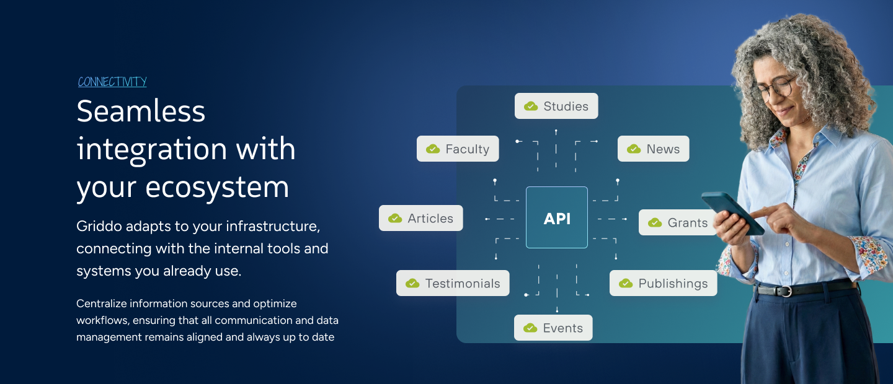

[Platform](https://griddo.io) | [Releases](https://griddo.io/en/releases/) | [Roadmap](https://griddo.io/en/upcoming) | [Support](https://griddo.io/en/support) 

# The Digital Expereince Platform for Universities

Griddo is a DXPpbuild around a modern MACH architecture
- Microservices: manage the integration of information and serveces, both internal and external to the University
- API: Our API Restful combined with an internal GraphQL handle the integration with all the services and the components. 

- Cloud: We leverage the cloud to offer a SaaS experience
- Headless: Griddo can your as your content Hub for all your needs regardless of the font end

Our architecture is created to deliver Security by Design

We deliver to the web with a SSG aproach to minimize the surface of attacks and maximize performance

- No DDoS, no SQL injections
- Edge delivery right to the CDN with WAF protection

Connect with any system and automaticaly udapte data everywhere

**Explore Griddo**: Visit [https://griddo.io](https://griddo.io) to learn more and request a demo.

**structured info** 
- json format: [llms.json](./llms.json)
- markdown format: [llms.md](./llms.md)

