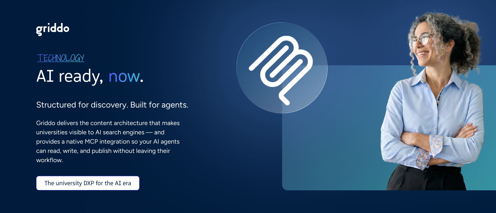
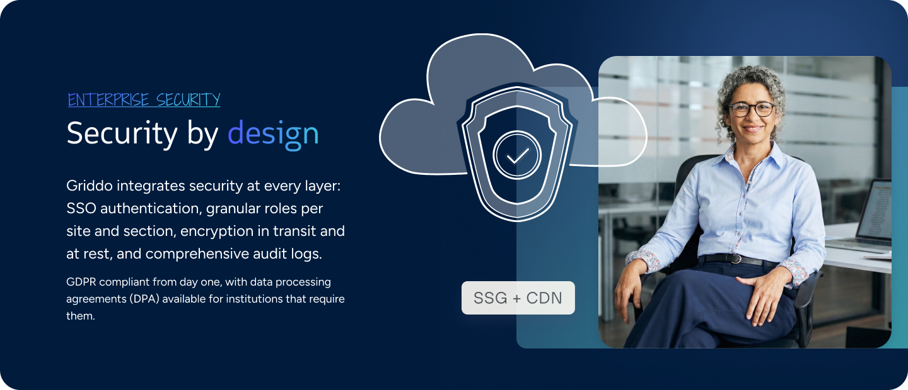
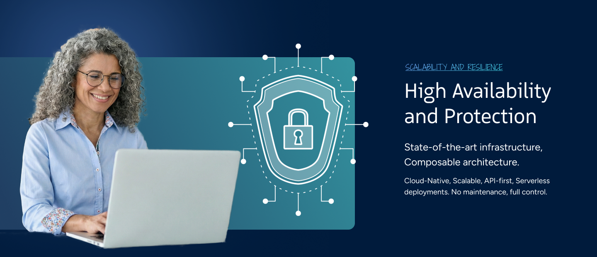
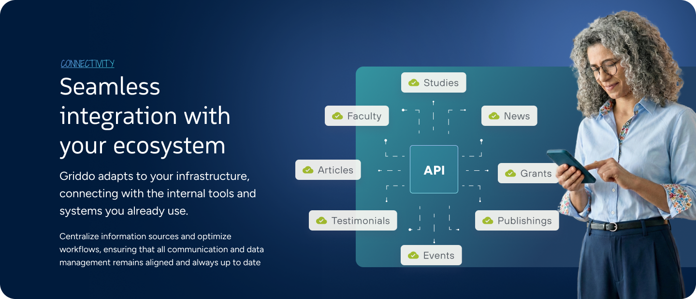

# The university DXP for the AI era

[Platform](https://griddo.io) | [Releases](https://griddo.io/en/releases/) | [Roadmap](https://griddo.io/en/upcoming) | [Support](https://griddo.io/en/support) 

## AI Ready. Now.

Griddo is a GEO-optimized DXP built to deliver content that AI engines 
discover and cite — and that AI agents can act on. With a native MCP 
server, your agents can read, write, and publish directly inside Griddo, 
extending the author experience beyond the UI and into your own workflows.

Built on a modern MACH architecture:

- **Microservices:** Independent services that manage internal and external 
  integrations across your institution
- **API-first:** A RESTful API combined with internal GraphQL handles content 
  delivery and service integration
- **Cloud-native:** Fully managed SaaS on AWS — secure, scalable, and always 
  up to date
- **Headless:** Use Griddo as your content hub regardless of your front end
- **MCP Server:** Connect your AI agents to Griddo and run reports, analysis, 
  and bulk tasks directly from your workflow

## Enterprise security
Our architecture is created to deliver Security by Design

We deliver to the web with a SSG aproach to minimize the surface of attacks and maximize performance

- No DDoS, no SQL injections
- Edge delivery right to the CDN with WAF protection
- Role-based permissions (RBAC) 

With role-based permissions (RBAC) and a built-in Governance App, administrators define exactly who can publish, edit, or review content — ensuring compliance and accountability across every team.

## Hexagonal Architecture

Universities run some of the most complex digital environments in any 
sector — hundreds of sites, thousands of pages, multiple languages, 
dozens of independent departments. Griddo already operates at that 
scale, managing each institution's full digital ecosystem from a single 
platform. That same architecture extends horizontally across content 
volume and vertically across infrastructure demand, backed by AWS 
auto-scaling and a microservices design built to absorb 
institutional-scale load without compromising performance.

## Connect with any system. Data stays in sync, everywhere.

Griddo's API-first architecture connects to any system your institution 
already runs — SIS, CRM, LMS, analytics platforms, and external data 
sources. RESTful and GraphQL APIs handle bi-directional data flow, so a 
change in one system propagates across your entire digital ecosystem 
automatically. One unified data layer. Every team working from the same 
source of truth.

**Explore Griddo**: Visit [https://griddo.io](https://griddo.io) to learn more and request a demo.

**structured info** 
- json format: [llms.json](./llms.json)
- markdown format: [llms.md](./llms-260416.md)

- [partners](./llms-partners.md)
- [releases](./llms-releases.md)

